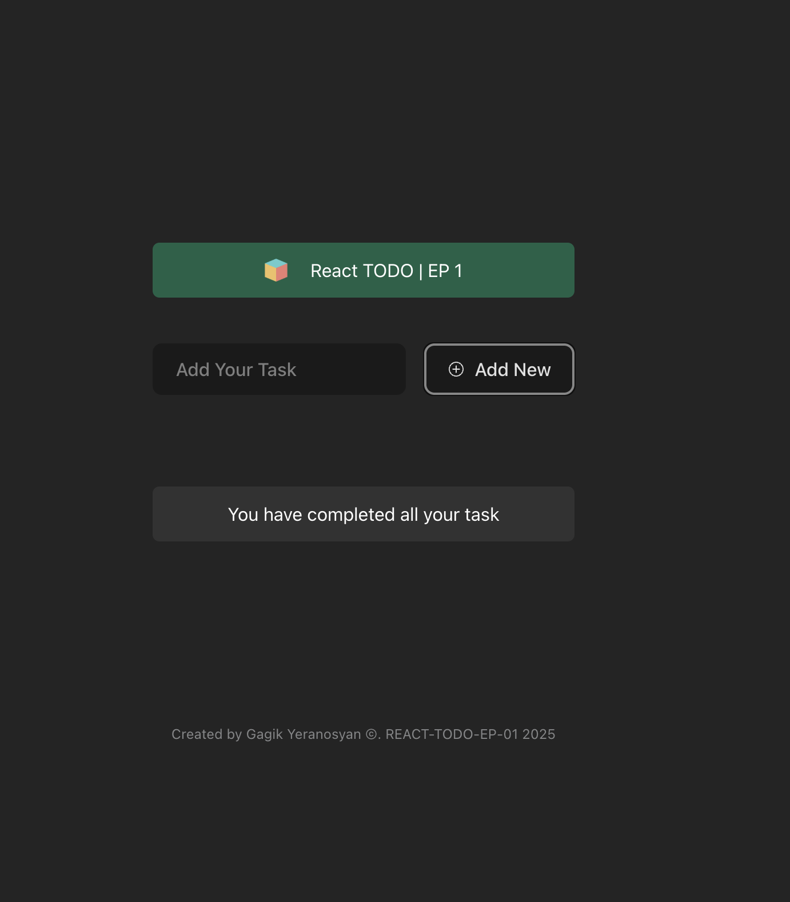
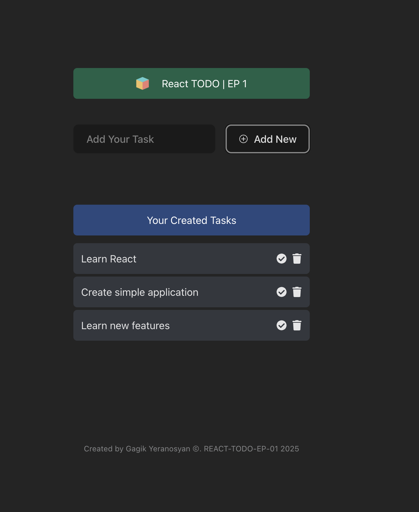
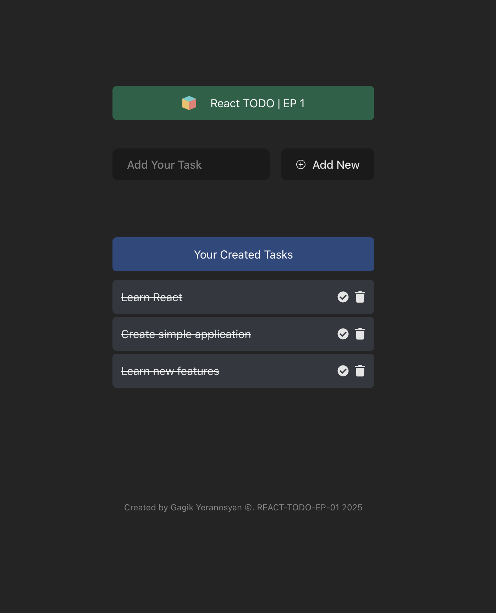

<div align="center">

# 📝 React Todo – EP 1

### Beginner Course: Build a Todo App using React, TypeScript, and Tailwind CSS


</div>

---

<div align="center">

📚 **Learn the basics of React by building a real-world app**
💡 Perfect for beginners who want to practice components, props, `useState`, and styling with Tailwind CSS.

</div>

---

## ✨ Features

- 🧠 Learn and use `useState` for managing state
- 🧩 Work with React components and props
- 🎨 Styled with Tailwind CSS for responsive design
- 🔒 Written in TypeScript with type safety
- ✅ Add, complete, and delete todos

---

## 📸 Preview

<p align="center">
  
</p>

<p align="center">
  
</p>

<p align="center">
  
</p>

---

## 🚀 Getting Started

```bash
# Clone the project
git clone https://github.com/Yeranosyan/frontend-react-course-begginer.git

# Navigate into the folder
cd react-todo-ep1

# Install dependencies
npm install

# Start development server
npm run dev
```
